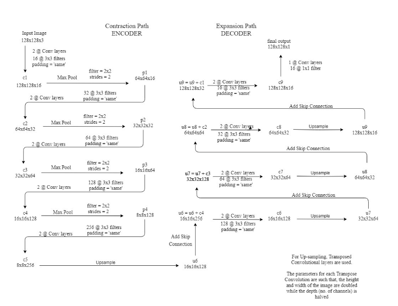
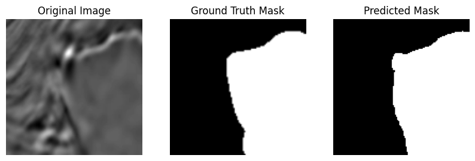

# BE 1 - Vision par ordinateur - Martin Guillerm and Frédéric Legrand

This work is our result in the computer vision course at ECL, here is the subject of our work: https://docs.google.com/document/d/1sbqmVY4H_FXkWiGUhXTxQqwH9pGkD-1YSO64tkrLf38/edit.

The aim of this work is to predict and locate the presence of salt deposits using seismic images.

This is the collaborative work of Martin Guillerm and Frederic Legrand.

## Model implementation : 

We have built a model based on the following picture : 

after training and validation we could obtain this type of result :

### Original Image |  Real Mask   | Predicted Mask

## Questions : 

### Max Pooling :

Of course we can use strided convolution insted of max pooling. This will reduce the number of operations as the convolutional layer itself performs both dimensionality reduction and feature extraction, whereas max pooling only reduces dimensionality by retaining only the maximum value in each region.

Nonetheless, Max pooling can help prevent overfitting by reducing dimensionality and introducing translational invariance in the extracted features. This can act as a form of regularization by preventing the model from over-adapting to specific details in the training data.

In comparison, convolution with a stride of 2 may not provide the same type of implicit regularization because it retains more spatial information and may potentially allow the model to memorize finer details of the training data, which can lead to greater overfitting.

In this context, max pooling can be considered a more direct technique for preventing overfitting, by reducing dimensionality in a nonlinear manner and introducing spatial invariance.

### Skip Connections :

The skip connections are important because they allow to preserve information at different spatial scales within the network. In our case, they allow the decoder to obtain information from the encoder that it would not have access to otherwise.

By removing these connections, the model would lose this ability to integrate information from different spatial resolutions, which could result in a loss of performance, especially for tasks requiring a global understanding of the data, such as semantic image segmentation.

Instead of concatenation, it would be possible to use addition or Min and Max functions. For example, Max would favor the most important features while Min would focus on the least frequent points. However, concatenation seems to produce the best results as it allows the network to have both a localized and a global view of the image.

### FCN and Auto-encoder :

A FCN uses convolutional layers without fully connected layers to preserve the image size throughout the process. This means that the receptive field of the network is limited, so the captured context is more restricted. 

Therefore, even if using a FCN is possible in our case, the autoencoder remains the best choice. Indeed, by gradually reducing spatial dimensions, the autoencoder will be able to incorporate more global information. Then, the expansion path will refine the localization. Thus, we will have finer and more precise results than with a FCN while still maintaining a good global sense of the image.

### Threshold for inference :

In our case, where we classify pixels as salt or non-salt for image segmentation, precision is defined as the number of pixels correctly classified as salt (true positives) divided by the total number of pixels classified as salt (true positives + false positives). Recall is defined as the number of pixels correctly classified as salt (true positives) divided by the total number of pixels that are actually salt (true positives + false negatives). 

If we want to optimize precision, we can increase this threshold. This would classify fewer pixels as salt, but those that are would be more likely to be correct. However, this could decrease recall because some pixels that are actually salt could be classified as non-salt. Conversely, if we need high recall (to minimize false negatives), we could lower the threshold. This would classify more pixels as salt, but it would also increase the risk of false positives. 

By adjusting the threshold appropriately, depending on the specific needs of our use case, we could find a balance between precision and recall to achieve the best possible results.

It is also possible to use ROC AUC curves. The ROC curve represents the performance of a binary classification model at different classification thresholds. It plots the true positive rate (recall) against the false positive rate for different classification thresholds. The AUC measures the model's ability to correctly classify positive examples compared to negative examples, regardless of the classification threshold. 

To optimize both precision and recall, we could choose the classification threshold that maximizes both precision and recall or maximizes the AUC of the ROC curve. If we are seeking a compromise between precision and recall, we could choose the threshold that balances these two metrics according to the specific needs of our use case.